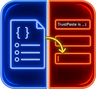

# TrustPaste

<p align="center">
  
</p>


**A [Futurion Solutions S.L.](https://solutions.futurion.es) product.**

TrustPaste is a Manifest V3 browser extension for selecting a value from an imported business JSON profile and inserting it into the field you choose. Search uses paths, keys, and values; ranking can account for favorites, recent use, field context, language, scope, and character limits. Nothing is filled until you select an entry.

## User guide

For complete, illustrated instructions, see the [TrustPaste User Guide](docs/TrustPaste-User-Guide.pdf). It covers manual installation, configuration, JSON-profile preparation and import, picker use, safety boundaries, troubleshooting, reset, and removal for TrustPaste 1.0.4 on desktop Chromium browsers.

## Why TrustPaste is different

Most autofill and "business profile" tools ask you to create an account and sync your data to their servers. **TrustPaste never does.** There is no server, no account, no cloud sync, no telemetry, and no analytics anywhere in the extension. Every operation — importing your JSON profile, searching, ranking, previewing, and inserting a value — runs entirely on your device.

Imported JSON, preferences, favorites, and recent paths stay in `chrome.storage.local`, isolated to the current browser profile. The only production `fetch` in the entire codebase loads the extension's own packaged `content/picker.css` stylesheet through `chrome.runtime.getURL()`; it is a local resource lookup, not a network request to a third party. There are no host permissions, so TrustPaste cannot read or send page content to anywhere outside your browser.

The background service worker routes toolbar, shortcut, context-menu, and options requests. On invocation it injects the page-side modules under the temporary `activeTab` grant. It never receives your imported profile values, and value insertion happens entirely on the page side, in your browser.

TrustPaste never submits forms automatically. Always review the form, complete CAPTCHA manually, verify consent and terms, and click the final submission button yourself.

## Built-in field-type refusals

TrustPaste is designed to refuse to touch sensitive fields, not just to avoid them by convention. Classification runs twice — once before the picker opens, and again immediately before a value is inserted — so a field cannot be filled if it is reclassified as unsupported between those two moments.

TrustPaste refuses:

- **Password fields**
- **Payment fields** — detected via `autocomplete` tokens such as `cc-number`, `cc-csc`, and `cc-exp`
- Hidden inputs
- File inputs
- Checkboxes and radio buttons
- Date, datetime-local, month, week, and time controls
- Color and range controls
- Buttons (`submit`, `button`, `reset`, `image`)
- Disabled fields
- Readonly fields

TrustPaste does not upload files, solve or interact with CAPTCHA, click buttons, accept terms, or submit forms — under any circumstance.

## Permissions

TrustPaste requests only `storage`, `contextMenus`, `activeTab`, and `scripting`. It has **no host permissions** — it cannot access any page until you explicitly invoke it on that page. Extension pages run under a strict content security policy (`script-src 'self'; object-src 'self'`); there is no remote code and no remote resource loading.

## Install from this folder

No build or package installation is required. Keep the complete TrustPaste folder together in a permanent local location.

- Chrome or Chromium: open `chrome://extensions`, enable Developer mode, choose **Load unpacked**, and select the folder that contains `manifest.json`.
- Brave: open `brave://extensions`, enable Developer mode, choose **Load unpacked**, and select the folder that contains `manifest.json`.
- Microsoft Edge: open `edge://extensions`, enable Developer mode, choose **Load unpacked**, and select the folder that contains `manifest.json`.

Do not select the `manifest.json` file itself or a parent folder that only contains the extension. Pin TrustPaste if you want its toolbar button visible. Shortcut assignments can be reviewed or changed at `chrome://extensions/shortcuts`, `brave://extensions/shortcuts`, or `edge://extensions/shortcuts`. A managed browser may restrict Developer mode; contact your browser or IT administrator rather than bypassing organizational controls.

After loading, confirm that the TrustPaste extension card is enabled and shows the expected version. To update an unpacked copy, retain or export any profile you need, replace the source folder, then use **Reload** on the extension card when the path is unchanged. Incognito access is optional and off by default; if enabled, remember that `chrome.storage.local` is shared with the regular extension process, so it does not create a separate or temporary profile store.

## Import a JSON profile

Open the extension's **Details** page and choose **Extension options**, or use the options link shown when no profile is present. Select a local `.json` file and choose **Import profile**. The page reports the flattened entry count and shows a safe text-only preview. JSON must have an object or array at its root; nested objects and arrays are supported, and primitive leaves become selectable values.

For example:

```json
{
  "company": {
    "name": "Example Studio",
    "website": "https://example.invalid",
    "descriptions": {
      "en": {
        "short_160": "A concise description for listings."
      },
      "es": {
        "short_160": "Una descripción breve para directorios."
      }
    }
  }
}
```

The bundled [sample profile](examples/sample-profile.json) is a curated bilingual Futurion Solutions dataset with 521 searchable primitive entries covering the company, audiences, delivery stages, products, services, use cases, limitations, differentiators, and claim guardrails. It contains no pricing and no public company telephone number because no telephone is confirmed by the local source material. Telephone fields remain supported when an imported profile supplies a phone value.

Existing installations do not receive profile changes automatically. If you previously imported the sample, re-import the updated file from the options page to receive the enriched entries. Imported files are treated as untrusted data and are rendered with DOM text nodes, never interpreted as HTML or code.

Keep only information you are authorized to reuse in a profile, and validate the JSON before importing it. If you use an approved AI assistant to prepare non-sensitive profile data, review the result before import and never submit confidential, personal, regulated, credential, payment, or otherwise unauthorized information to an unapproved service.

## Use the picker

Focus a supported field, then use one of these methods:

- Press **Alt+J** (Option+J on macOS). The command can be reassigned in the browser's extension-shortcut page.
- Select **Insert business data** from the editable field's context menu.
- Click the pinned toolbar button. Toolbar and shortcut invocation use the focused field, or the last supported field if focus has moved to a non-field browser/page control. A currently focused unsupported field still receives its precise unsupported-type message.

Type one or more words to search. Every word must match the normalized path, label, or value. Use Up/Down and Page Up/Page Down to move, Enter to insert, Escape to close, or click a result. The picker supports Replace and At cursor modes. Long previews can be expanded. Values over a real `maxlength` are not inserted until **Insert anyway** is selected.

Starred entries appear under Favorites. Successfully inserted paths are added to Recent locally; profile values are not duplicated in recent history. The options page can clear either list.

Language preference boosts English or Spanish path aliases and lowers the other language, without hiding results. Automatic mode uses the page's language when recognized. Active scope boosts a selected JSON-path prefix; **Limit results to active scope** hides entries outside it. Neither feature automatically chooses or inserts a value.

## Supported and unsupported fields

Supported controls are text, URL, email, telephone, search, and number inputs; inputs with no explicit type; ordinary textareas; and contenteditable elements. Standard controls are updated through their native prototype setter, followed by bubbling, composed `input` and `change` events for framework compatibility. Contenteditable insertion is plain text only.

TrustPaste refuses password and payment fields, file inputs, checkboxes, radio buttons, hidden inputs, date/time/month/week controls, color and range controls, buttons, disabled fields, and readonly fields. It does not upload files, solve or interact with CAPTCHA, click buttons, accept terms, or submit forms.

## Iframes and rich-text editors

At invocation time, the extension follows focus through nested same-origin frames when their documents are accessible. Cross-origin, opaque sandboxed, null, or otherwise inaccessible frame documents are treated as restricted and are never read. A field in such a frame cannot be filled. Browser internal pages, extension stores, and built-in PDF viewers also reject injection and show a `!` action badge with a per-tab explanation.

Contenteditable insertion intentionally creates text nodes, not markup. Editor-specific document models in TinyMCE, CKEditor, Quill, ProseMirror, and Slate may ignore, transform, or undo generic DOM/input events. Use the editor's ordinary paste workflow if its state does not retain the inserted plain text.

## Troubleshooting

- **No business data imported:** use the toast's **Open options** button and import a valid `.json` profile.
- **JSON import failed:** the inline alert includes the native parser detail and line/column/position when the browser exposes a position.
- **Focus a supported editable field:** click inside a supported control before invoking the picker.
- **Unsupported field message:** the named control is intentionally protected; choose a supported text field instead.
- **Cross-origin iframe message:** open the framed application directly if appropriate, then invoke the extension there.
- **`!` badge:** inspect the toolbar title. The current tab is restricted, a PDF, or rejected content-script injection.
- **Storage error:** confirm extension storage is enabled and reload the extension. A repaired malformed state is reported once; reset and re-import if needed.
- **No results:** clear or broaden the search and check language/scope/null preferences.
- **Shortcut does not open:** check the browser extension-shortcut page for a conflict or changed assignment.
- **Rich editor reverts text:** use its supported plain-text paste workflow; editor-specific APIs are deliberately not integrated.

## Remove stored data

In Options, **Reset TrustPaste** removes the imported profile, preferences, favorites, and recent history from the extension's `chrome.storage.local` key. This destructive action cannot restore deleted extension state, so retain a separate copy of any profile you need. To remove all extension storage and code, remove the extension from the browser's extensions page; browser removal clears its isolated local storage.

## Support

For reproducible problems or support requests, use [GitHub Issues](https://github.com/futuriones/TrustPaste/issues). Include the browser and version, operating system, TrustPaste version, field type, invocation method, displayed message, and reproducible steps. Use a non-sensitive test page or sample JSON when helpful; never attach a real profile or confidential, personal, regulated, credential, or payment information.

## Development and verification

The extension is dependency-free and loads directly from source:

- `background/` contains the self-contained service worker.
- `content/` contains targeting, notifications, picker, and insertion modules.
- `shared/` contains constants, storage validation, flattening, normalization, search, synonyms, and ranking.
- `options/` contains the local profile/settings interface.
- `examples/` contains the sample profile.
- `tests/unit.html` is the automated browser harness; `tests/manual-test.html` is the acceptance surface.

The picker runtime-message contract uses a synchronous receipt acknowledgement. A content listener
that accepts `LBA_OPEN_PICKER` immediately responds with `{ "type": "LBA_OPEN_PICKER_ACK" }` before
starting asynchronous storage and picker work. The service worker treats a missing or malformed
acknowledgement as an unreachable content script; picker outcomes such as an inaccessible iframe are
reported by the content script and do not set the unreachable action badge.

Security boundaries include least-privilege permissions, no remote code/resources, strict extension-page CSP, untrusted JSON validation, text-only rendering, protected-field classification at selection and insertion time, no stored DOM references, and value-free operational diagnostics. See [TESTING.md](TESTING.md) for automated results, review evidence, and manual-Chrome status.

---

TrustPaste is developed and maintained by **Futurion Solutions S.L.**
